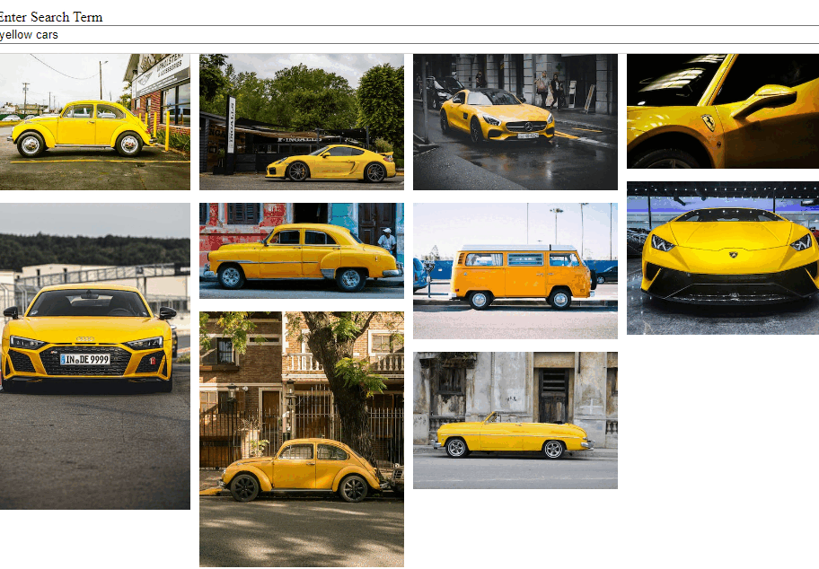

# Gimage React App

- Get images from an API and show them related to search term.
- This app uses [Unsplash API](https://unsplash.com/developers)

## Usage

- In order to use this app use your own Unsplash API access key.
- Copy and paste your api access key to "accessKey" variable in the "api.js" file.

## This project is from [Stephen Grider's Modern React Course](https://www.udemy.com/course/react-redux/)
